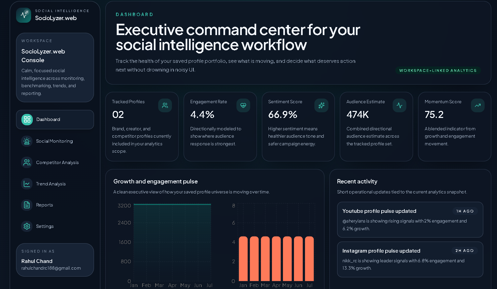
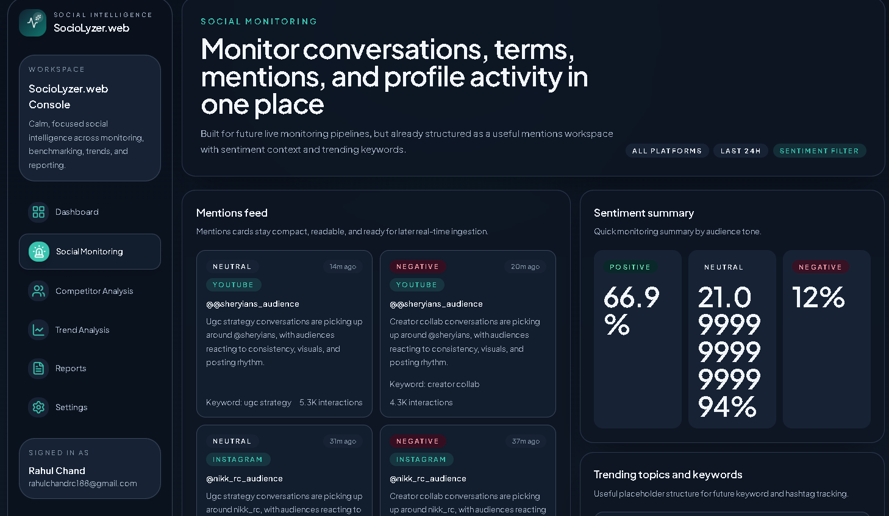
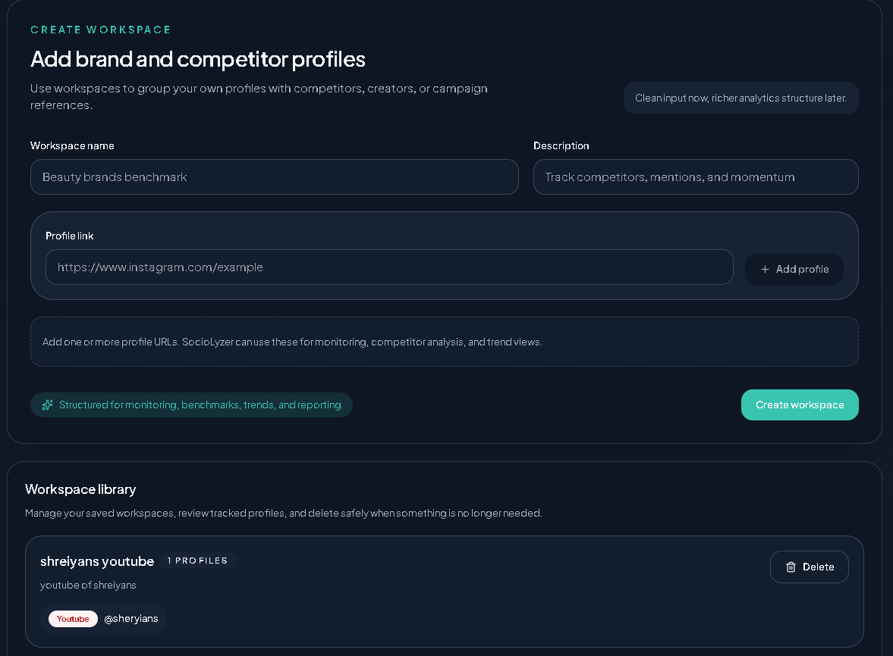
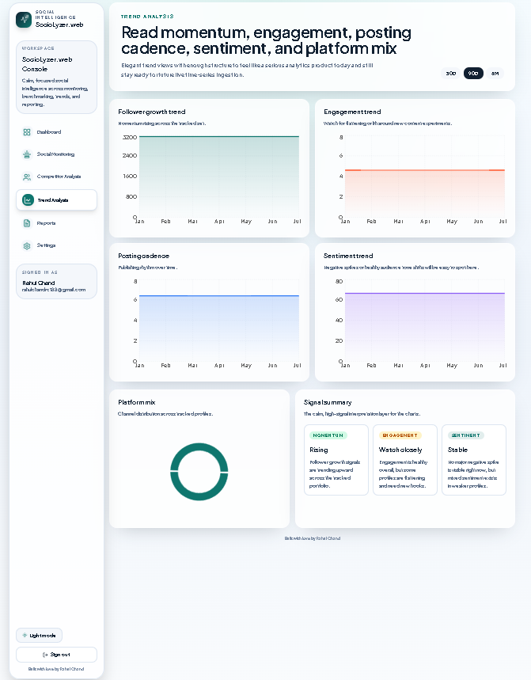

# SocioLyzer

Beginner-friendly social media analytics starter built with React, Vite, Tailwind CSS, Firebase Auth, Firestore, Cloud Functions, and Firebase Hosting.

## What is included

- Google sign-in with protected routes
- Modern responsive landing page and dashboard
- Profile-link-first workspace creation flow
- Platform detection for major social links
- Firestore-ready user and workspace storage structure
- Simple Cloud Functions starter for future analytics preparation
- Firebase Hosting and Firestore configuration files

## Frontend structure

```text
src/
  app/                 Router setup
  components/          Reusable UI and dashboard components
  features/            Auth and workspace-specific logic
  lib/                 Firebase client setup and shared helpers
  pages/               Route-level pages
  services/            Firestore read/write logic
  types/               Shared TypeScript types
```

## Firestore shape

```text
users/{userId}
users/{userId}/workspaces/{workspaceId}
users/{userId}/workspaces/{workspaceId}/profiles/{profileId}
```

This structure keeps ownership clear and makes beginner-friendly security rules much easier to reason about.

## Local setup

1. Install dependencies in the root:

   ```bash
   npm install
   ```

2. Copy `.env.example` to `.env.local` and paste your Firebase web app config.

3. Install functions dependencies:

   ```bash
   cd functions
   npm install
   cd ..
   ```

4. Start the web app:

   ```bash
   npm run dev
   ```

## Firebase steps you will do in the console

1. Create a Firebase project.
2. Add a Web App and copy its config into `.env.local`.
3. Enable Google sign-in in Authentication.
4. Create a Firestore database in production mode.
5. Deploy the included `firestore.rules`.
6. Enable Cloud Functions and Hosting for the project.

## Deployment

After installing Firebase CLI and logging in:

```bash
firebase use your-project-id
firebase deploy
```


## Screenshots

### Dashboard Page


### Monitoring page


### Workspace Creation


### Graphical Analytics page


### Reports page
